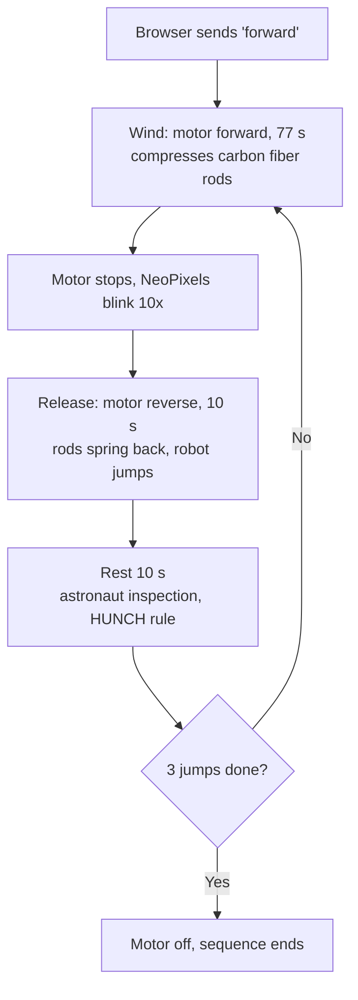

# TARS: Autonomous Lunar Terrain-Scouting Robot

Software for TARS, a single-motor jumping robot built for NASA HUNCH (2025-2026). Runs on an ESP32-CAM in C++ (Arduino): live video streaming, a browser control page, and a timed autonomous jump sequence.

> **NASA HUNCH national finalist.** One of 4 finalist teams (out of 8-10) whose robot completed autonomous, repeated jumps.

<!-- TODO: add a photo or GIF of TARS jumping here -->

**[Jump straight to the autonomous sequence in the code](https://github.com/seandhaverkamp77-gif/TARS-lunar-jumping-robot/blob/main/main-source-code#L356-L405)**

## Overview

Astronauts on the lunar surface will need higher-resolution terrain data than the Lunar Reconnaissance Orbiter can provide (0.5 m/pixel). TARS is designed to be deployed by astronauts and jump to scout the surrounding terrain, using a spring-loaded mechanism (compressed carbon fiber rods) and an onboard camera. It was built for NASA's Artemis-era Moon to Mars initiative through HUNCH's Design and Prototype program.

Built by a 4-person team at Green Mountain High School. TARS was invited to Johnson Space Center in Houston to present to NASA astronauts and engineers and defend its design in NASA-style design reviews.

## My Role

Software lead. I was responsible for the onboard control system running on the ESP32-CAM.

## How the Jump Sequence Works

TARS uses one motor and one direction change. Running the motor one way winds the release mechanism, compressing the carbon fiber rods. Reversing it releases the mechanism and launches the robot. The sequence repeats for 3 jumps.

It is a hardcoded, open-loop sequence: fixed timers, no sensor feedback. Once triggered, it runs with no operator input.

### Control page

The robot is controlled from a browser page over Wi-Fi, with the live camera feed above the buttons:

| Button | What it does on TARS |
|--------|----------------------|
| Forward | Starts the autonomous jump sequence (label left over from the original car example) |
| Right | Winds the mechanism manually (hold to run) |
| Left | Releases the mechanism's tension manually (hold to run) |
| Stop | Turns the motor off |

## What's Mine vs. Adapted

The camera streaming, web server, and browser control page come from the open-source [ESP32-CAM Remote Controlled Car Robot Web Server](https://randomnerdtutorials.com/esp32-cam-car-robot-web-server/) by Random Nerd Tutorials. I adapted them for a single-motor robot.

My work:
- Repurposed the "forward" command into the timed jump sequence
- Wrote the wind / release / rest timing around the mechanism and the HUNCH inspection rule
- Added NeoPixel status feedback (the lights blink before each release)
- Repurposed the left and right buttons as manual wind and release controls
- Debugged brownout resets under motor load and redesigned the trigger (see below)

Motor 2 is unused on TARS. Its pins and code are leftovers from the original 2-wheel car example.

## From Button to Hardcoded Sequence

The original design used a button to trigger each jump. When the motor reached the bottom of the platform, it signaled the mechanism to release. Under motor load the ESP32 started brownout-resetting: the current draw dropped the voltage enough to reset the board mid-launch. That made the button trigger unreliable right when it mattered.

With the competition deadline close, I replaced the trigger with a pre-programmed timing sequence. It isn't the most elegant fix, but it removed the failure point, and it's what got TARS to repeated autonomous jumps.

<!-- TODO: add what else you changed for the power problem (wiring, supply, etc.) -->

## Known Limitations

- **"Stop" can't interrupt a running sequence.** The sequence uses `delay()`, which blocks the web server, so a stop command waits until it finishes. A future version could use `millis()`-based timing so a stop command can cut the motor.
- **Open-loop.** The timing is fixed and doesn't react to sensors.
- The sketch disables the ESP32 brownout detector. This hides voltage dips instead of fixing them.

## Project Website

Full engineering documentation for TARS (design iterations, testing, electronics) is on our team site:
- [GMHS TARS project site](https://sites.google.com/jeffcoschools.us/gmhstars/home)
- [Automated jump sequence and camera](https://sites.google.com/jeffcoschools.us/gmhstars/automated-jump-sequence-and-camera): how the control page and jump sequence work
- [Release mechanism testing](https://sites.google.com/jeffcoschools.us/gmhstars/testing/release-mechanism-testing): 98 trials, 89.7% success rate (team testing)

## Tech Stack

- ESP32-CAM (AI Thinker), C++ / Arduino framework
- H-bridge motor control
- NeoPixel LEDs for status feedback
- Wi-Fi video streaming and a browser-based control page

## Outcome

- NASA HUNCH national finalist (1 of 8-10 teams)
- One of 4 finalist teams whose robot jumped autonomously, multiple times in a row
- Presented the working prototype and defended design decisions in NASA-style design reviews at Johnson Space Center
